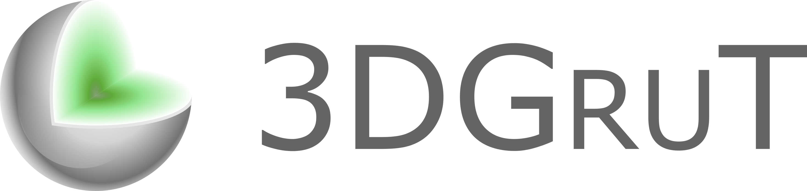
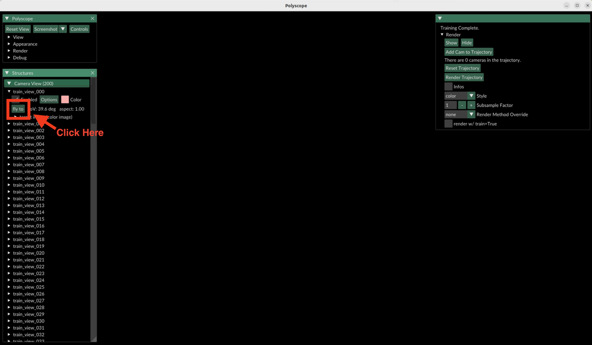
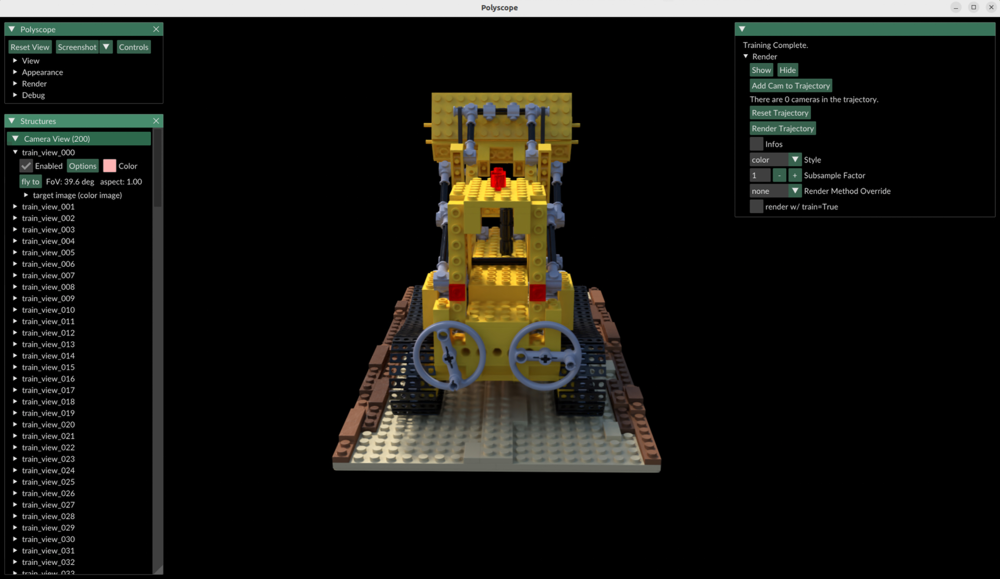

<p align="center">
  
</p>

---
<p align="center">
  
</p>

This repository provides the official implementations of **3D Gaussian Ray Tracing (3DGRT)** and **3D Gaussian Unscented Transform (3DGUT)**. Unlike traditional methods that rely on splatting, 3DGRT performs ray tracing of volumetric Gaussian particles instead. This enables support for distorted cameras with complex, time-dependent effects such as rolling shutters, while also efficiently simulating secondary rays required for rendering phenomena like reflection, refraction, and shadows. However, 3DGRT requires dedicated ray-tracing hardware and remains slower than 3DGS.

To mitigate this limitation, we also propose 3DGUT, which enables support for distorted cameras with complex, time-dependent effects within a rasterization framework, maintaining the efficiency of rasterization methods. By aligning the rendering formulations of 3DGRT and 3DGUT, we introduce a hybrid approach called **3DGRUT**. This technique allows for rendering primary rays via rasterization and secondary rays via ray tracing, combining the strengths of both methods for improved performance and flexibility.


> __3D Gaussian Ray Tracing: Fast Tracing of Particle Scenes__  
> [Nicolas Moenne-Loccoz*](https://www.linkedin.com/in/nicolas-moënne-loccoz-71040512/?original_referer=https%3A%2F%2Fwww%2Egoogle%2Ecom%2F&originalSubdomain=ca), [Ashkan Mirzaei*](https://ashmrz.github.io), [Or Perel](https://orperel.github.io/), [Riccardo De Lutio](https://riccardodelutio.github.io/), [Janick Martinez Esturo](https://jme.pub/),   
> [Gavriel State](https://www.linkedin.com/in/gavstate/?originalSubdomain=ca), [Sanja Fidler](https://www.cs.utoronto.ca/~fidler/), [Nicholas Sharp^](https://nmwsharp.com/), [Zan Gojcic^](https://zgojcic.github.io/) _(*,^ indicates equal contribution)_  
> _SIGGRAPH Asia 2024 (Journal Track)_  
> __[Project page](https://research.nvidia.com/labs/toronto-ai/3DGRT)&nbsp;/ [Paper](https://research.nvidia.com/labs/toronto-ai/3DGRT/res/3dgrt_compressed.pdf)&nbsp;/ [Video](https://research.nvidia.com/labs/toronto-ai/3DGRT/res/3dgrt_supplementary_video.mp4)&nbsp;/ [BibTeX](/-/raw/release/assets/3dgrt2024.bib)__

> __3DGUT: Enabling Distorted Cameras and Secondary Rays in Gaussian Splatting__  
> [Qi Wu*](https://wilsoncernwq.github.io/), [Janick Martinez Esturo*](https://jme.pub/), [Ashkan Mirzaei](https://ashmrz.github.io),   
> [Nicolas Moenne-Loccoz](https://www.linkedin.com/in/nicolas-moënne-loccoz-71040512/?original_referer=https%3A%2F%2Fwww%2Egoogle%2Ecom%2F&originalSubdomain=ca), [Zan Gojcic](https://zgojcic.github.io/)  _(* indicates equal contribution)_  
> _CVPR 2025_  
> __[Project page](https://research.nvidia.com/labs/toronto-ai/3DGUT)&nbsp;/ [Paper](https://research.nvidia.com/labs/toronto-ai/3DGUT/res/3DGUT_ready_main.pdf)&nbsp;/ [Video](https://research.nvidia.com/labs/toronto-ai/3DGUT/#supp_video)&nbsp;/ [BibTeX](/-/raw/release/assets/3dgut2025.bib)__


## 🔥 News
- ✅[2025/03] Initial code release!
- ✅[2025/02] [3DGUT](https://research.nvidia.com/labs/toronto-ai/3DGUT/res/3DGUT_ready_main.pdf) was accepted to CVPR 2025!
- ✅[2024/08] [3DGRT](https://research.nvidia.com/labs/toronto-ai/3DGRT/res/3dgrt_compressed.pdf) was accepted to SIGGRAPH Asia 2024!

## Contents

- [🔥 News](#-news)
- [Contents](#contents)
- [🔧 1 Dependencies and Installation](#-1-dependencies-and-installation)
- [💻 2. Train 3DGRT or 3DGUT scenes](#-2-train-3dgrt-or-3dgut-scenes)
- [🎥 3. Rendering from Checkpoints](#-3-rendering-from-checkpoints)
  - [To visualize training progress interactively](#to-visualize-training-progress-interactively)
  - [To visualize a pre-trained checkpoint](#to-visualize-a-pre-trained-checkpoint)
- [📋 4. Evaluations](#-4-evaluations)
  - [3DGRT](#3dgrt)
    - [MipNeRF360 Dataset](#mipnerf360-dataset)
  - [3DGUT](#3dgut)
    - [MipNeRF360 Dataset](#mipnerf360-dataset-1)
    - [Scannet++ Dataset](#scannet-dataset)
- [🛝 5. Interactive Playground GUI](#-5-interactive-playground-gui)
- [🎓 6. Citations](#-6-citations)
- [🙏 7. Acknowledgements](#-7-acknowledgements)

## 🔧 1 Dependencies and Installation
- CUDA 11.8+ Compatible System
- For good performance with 3DGRT, we recommend using an NVIDIA GPU with Ray Tracing (RT) cores.
- Currently, only Linux environments are supported by the included install script (Windows support coming soon!)

<details> 
<summary> NOTE: gcc versions >11 (expand for details)</summary>

Currently the codebase requires gcc <= 11.  If your machine uses the compiler gcc-12 or newer (i.e., in Ubuntu 24.04), you may need to install and use gcc-11. 

First, install gcc 11:
```sh
sudo apt-get install gcc-11 g++-11
```

Then run the install script with the optional `WITH_GCC11` flag, which additionally configures the conda environment to use gcc-11:
```sh
./install_env.sh 3dgrut WITH_GCC11
```
</details>
</br>

To set up the environment using conda, first clone the repository and run `./install_env.sh` script as:

```bash
git clone --recursive https://github.com/nv-tlabs/3dgrut.git
cd 3dgrut

# You can install each component step by step following install_env.sh
chmod +x install_env.sh
./install_env.sh 3dgrut
conda activate 3dgrut
```

## 💻 2. Train 3DGRT or 3DGUT scenes

We provide different configurations for training using 3DGRT and 3DGUT models on common benchmark datasets. 
For example you can download [NeRF Synthetic dataset](https://www.kaggle.com/datasets/nguyenhung1903/nerf-synthetic-dataset), 
[MipNeRF360 dataset](https://jonbarron.info/mipnerf360/) or [ScanNet++](https://kaldir.vc.in.tum.de/scannetpp/), 
and then run one of the following commands:

```bash
# Train Lego with 3DGRT & 3DGUT
python train.py --config-name apps/nerf_synthetic_3dgrt.yaml path=data/nerf_synthetic/lego out_dir=runs experiment_name=lego_3dgrt
python train.py --config-name apps/nerf_synthetic_3dgut.yaml path=data/nerf_synthetic/lego out_dir=runs experiment_name=lego_3dgut

# Train Bonsai
python train.py --config-name apps/colmap_3dgrt.yaml path=data/mipnerf360/bonsai out_dir=runs experiment_name=bonsai_3dgrt dataset.downsample_factor=2 
python train.py --config-name apps/colmap_3dgut.yaml path=data/mipnerf360/bonsai out_dir=runs experiment_name=bonsai_3dgut dataset.downsample_factor=2 

# Train Scannet++
python train.py --config-name apps/scannetpp_3dgut.yaml path=data/scannetpp/0a5c013435/dslr out_dir=runs experiment_name=0a5c013435_3dgut
```

> [!Note] 
> For ScanNet++, we expect the dataset to be preprocessed following [FisheyeGS](https://github.com/zmliao/Fisheye-GS?tab=readme-ov-file#prepare-training-data-on-scannet-dataset)'s method.

> [!Note]  
> If you're running from PyCharm IDE, enable rich console through:
> Run Configuration > Modify Options > Emulate terminal in output console*

## 🎥 3. Rendering from Checkpoints
Evaluate Checkpoint with Splatting / OptiX Tracer / Torch
```bash
python render.py --checkpoint runs/lego/ckpt_last.pt --out-dir outputs/eval
```


### To visualize training progress interactively
```bash
python train.py --config-name apps/nerf_synthetic_3dgut.yaml path=data/nerf_synthetic/lego with_gui=True 
```

### To visualize a pre-trained checkpoint
```bash
python train.py --config-name apps/nerf_synthetic_3dgut.yaml path=data/nerf_synthetic/lego with_gui=True test_last=False export_ingp.enabled=False resume=runs/lego/ckpt_last.pt 
```
> [!NOTE]
> Remember to set DISPLAY environment variable if you are running on a remote server

On start up, you might see a black screen, but you can use the GUI to navigate to correct camera views:
 


## 📋 4. Evaluations

We provide scripts to reproduce results reported in publications.

```bash
# Training
bash ./benchmark/mipnerf360_3dgut.sh <config-yaml>
# Rendering
bash ./benchmark/mipnerf360_3dgut_render.sh <config-yaml>
```

### 3DGRT

#### MipNeRF360 Dataset

### 3DGUT

#### MipNeRF360 Dataset

```bash
bash ./benchmark/mipnerf360.sh paper/3dgut/unsorted_colmap.yaml
```

Results for unsorted 3DGUT (Produced on RTX 5090):

|          | Bicycle | Bonsai  | Counter | Flower  | Garden  | Kitchen | Room    | Stump   | Treehill | *Average* |
|----------|---------|---------|---------|---------|---------|---------|---------|---------|----------|-----------|
| train(s) | 835.93  | 476.00  | 468.86  | 681.15  | 665.59  | 502.89  | 447.66  | 682.58  | 669.83   | 608.28    |
| FPS      | 269.5   | 362.3   | 336.7   | 276.2   | 333.3   | 310.6   | 383.1   | 333.3   | 326.8    | 325.8     |
| PSNR     | 24.737  | 32.235  | 28.448  | 21.326  | 26.699  | 30.393  | 31.130  | 26.289  | 22.518   | 27.086    |


#### Scannet++ Dataset

```bash
bash ./benchmark/scannetpp.sh paper/3dgut/unsorted_scannetpp.yaml
```
> [!Note]
> We followed [FisheyeGS](https://github.com/zmliao/Fisheye-GS?tab=readme-ov-file#prepare-training-data-on-scannet-dataset)'s convention to prepare the dataset for fair comparisons

Results for unsorted 3DGUT (Produced on RTX 5090):

|          | 0a5c013435 | 8d563fc2cc | bb87c292ad | d415cc449b | e8ea9b4da8 | fe1733741f | *Average* |
|----------|------------|------------|------------|------------|------------|------------|-----------|
| train(s) | 298.09     | 295.64     | 330.89     | 405.95     | 288.53     | 371.71     |  331.80   |
| FPS      | 408.2      | 465.1      | 490.2      | 446.4      | 401.6      | 444.4      |  442.7    |
| PSNR     | 29.790     | 26.848     | 31.610     | 28.084     | 33.259     | 25.608     |  29.200   |

## 🛝 5. Interactive Playground GUI

The playground allows interactive exploration of pretrained scenes, with raytracing effects such as inserted objects, 
reflections, refractions, depth of field, and more.

Run the playground UI to visualize a pretrained scene with:
```
python playground.py --gs_object <ckpt_path>
```

See [Playground README](playground/README.md) for details.


## 🎓 6. Citations

```
@article{loccoz20243dgrt,
    author = {Nicolas Moenne-Loccoz and Ashkan Mirzaei and Or Perel and Riccardo de Lutio and Janick Martinez Esturo and Gavriel State and Sanja Fidler and Nicholas Sharp and Zan Gojcic},
    title = {3D Gaussian Ray Tracing: Fast Tracing of Particle Scenes},
    journal = {ACM Transactions on Graphics and SIGGRAPH Asia},
    year = {2024},
}
```

```
@article{wu20253dgut,
    title={3DGUT: Enabling Distorted Cameras and Secondary Rays in Gaussian Splatting},
    author={Wu, Qi and Martinez Esturo, Janick and Mirzaei, Ashkan and Moenne-Loccoz, Nicolas and Gojcic, Zan},
    journal = {Conference on Computer Vision and Pattern Recognition (CVPR)},
    year={2025}
}
```

## 🙏 7. Acknowledgements

We sincerely thank our colleagues for their valuable contributions to this project.

Hassan Abu Alhaija, Ronnie Sharif, Beau Perschall and Lars Fabiunke for assistance with assets.
Greg Muthler, Magnus Andersson, Maksim Eisenstein, Tanki Zhang, Nathan Morrical, Dietger van Antwerpen and John Burgess for performance feedback.
Thomas Müller, Merlin Nimier-David, and Carsten Kolve for inspiration and pointers. 
Ziyu Chen, Clement Fuji-Tsang, Masha Shugrina, and George Kopanas for technical & experiment assistance,
and to Ramana Kiran and Shailesh Mishra for typo fixes.
