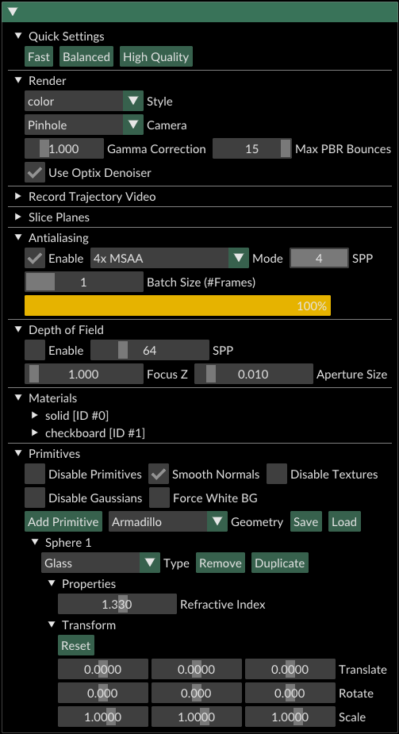

# The Playground  

**3D Gaussian Ray Tracing (3DGRT)** enables the rendering of secondary ray effects such as reflections, refractions, depth of field and others, as well as inserting ray-traced mesh assets with materials into the scene.

The **Playground** is an interactive demo app that showcases various effects in action.  See examples published with the paper on the 3DGRT [Project page](https://research.nvidia.com/labs/toronto-ai/3DGRT).

## 🔥 News

- ✅[2025/03] Playgroud v1.0 released (3dgrt + Glass, Mirrors, Diffuse Meshes, Depth of Field)


## Contents

- [The Playground](#-the-playground)  
  - [🔥 News](#-news)
  - [Contents](#-contents)
  - [🔧 Installation](#-installation)
  - [🏃🏻 How to Run 🏃🏼‍♀️](#-how-to-run)
    - [👻 Add your own assets](#-add-your-own-assets)
    - [Additional args️](#-additional-args)
  - [How it works️](#-how-it-works)
  - [🎮 Features ️](#-features)
    - [🌐 Mesh Primitives](#-mesh-primitives)
      - [🫙 Glass](#-glass)
      - [🪞 Mirror](#-mirror)
      - [🔵 Diffused Mesh](#-diffused-mesh)
    - [🖌️ Materials](#-materials)
    - [⚙️ Quick Settings](#-quick-settings)
    - [📸 Depth of Field](#-depth-of-field)
    - [✨ Antialiasing](#-antialiasing)
      - [🤖 Optix Denoiser](#-optix-denoiser)
    - [🛠️ Render Definitions](#-render-definitions)
    - [Other Features](#-other-features)
  - [🚀 Future Content](#-future-content)


## 🔧 Installation

1. [Install 3dgrut](../README.md), following instructions on main page.
2. Install additional Playground requirements:

```bash
conda install -c conda-forge mesa-libgl-devel-cos7-x86_64 # may be necessary for OpenGL headers
pip install -r playground/requirements.txt
```

## 🏃🏻 How to Run 🏃🏼‍♀️

1. Train a 3DGRT scene, for example:
```bash
python train.py --config-name apps/colmap_3dgrt.yaml path=data/mipnerf360/bonsai out_dir=runs experiment_name=bonsai dataset.downsample_factor=2
```

2. Run playground as follows:
```bash
python playground.py --gs_object runs/bonsai/ckpt_last.pt
```

The playground supports loading `.pt` checkpoints, and exported `.ingp` and `.ply` files.

### 👻 Add your own assets
3. If desired, gather your own additional mesh assets (`.obj`, `.glb`, `.gltf` formats), and place them under `playground/assets/`.
The playground will load them automatically as available *primitives* as soon as the app starts.
Some interesting shapes are [available here](https://github.com/alecjacobson/common-3d-test-models/tree/master).

4. Have fun experimenting! 

#### Additional args

```
python playground.py --gs_object <ckpt_path>  
                     [--mesh_assets <mesh_folder_path>]
                     [--default_gs_config <config_name>]
                     [--buffer_mode <"host2device" | "device2device">]
```
The full run command includes the following optional args:
* `--mesh_assets`: Path to folder containing mesh assets of .obj or .glb format. 
  * Defaults to `playground/assets`.
* `--default_gs_config`: Name of default config to use for .ingp, .ply files, or .pt files not trained with 3dgrt.
  * Defaults to `apps/colmap_3dgrt.yaml`.
* `--device2device`: Buffering mode for passing rendered data from CUDA to OpenGL screen buffer. Using device2device is recommended.
  * Defaults to `device2device`.

## How it Works

The Playground performs hybrid rendering of Gaussian particles and surface mesh primitive via ray tracing.

For each rendered frame:
1. A ray is traced from ray origin $\mathbf{r}_o$ against a BVH containing all mesh primitives in the scene.
Upon closest hit at point $\mathbf{x} \in \mathbb{R}^3$ , the ray may get redirected or shaded, depending on the surface mesh 
properties. These changes are memorized but not applied yet.
2. A 3dgrt volumetric integration phase runs for the segment of $[mathbf{r}_o, \mathbf{x}]$, to accumulate radiance.
3. If any radiance was contributed by the mesh, it is now taken into consideration. 
4. Loop back to step 1: the ray continues tracing using $\mathbf{x}$ as the new ray origin,
depending on redirection computed in step 1.

The process continues until the ray misses or accumulates enough radiance.

For antialiasing and depth of field, multiple rendering passes are used with ray jittering.

## 🎮 Features 

We invite you to explore the Playground by experimenting around!
Alternatively, in the following we discuss various features in depth.



### 🌐 Mesh Primitives

The *Primitives* subsection allows adding, removing and duplicating different geometries.

The available geometries always include the default Quad and Sphere, and optionally other meshe files
placed under `playground/assets`

The Playground is always loaded with a default Sphere primitive placed at the origin.

*Add Primitive* adds additional primitives at the origin. 

The *Transform* subsection allows translating,
rotating and scaling primitives to place and orient them around the scene.

Changing the primitive *Type* immediately modifies how rays interact with the mesh.

#### 🫙 Glass
Glass type primitives follow [Snell's law](https://en.wikipedia.org/wiki/Snell%27s_law) and refract rays that hit them,
essentially diverting their direction to show 3D Gaussians and meshes beyond the glass. 

Glass objects allow changing the *Refractive Index (IOR)* to manipulate the "thickness" of the mesh medium.

#### 🪞 Mirror
Mirror type primitives act as perfect mirrors that reflect the rays around the mesh normal.

#### 🔵 Diffused Mesh
Diffused Meshes use Lambertian shading, to render meshes with diffusive materials. As **3DGRT** uses baked light,
we set the incoming light intensity to $L_{I}=1.0$ and compute the ray color $C$ as:
$$C=\mathopen|\mathbb{n}\mathclose| \mathopen|\mathbb{r}_d\mathclose| * D$$

where $n$ is the hit mesh normal, $\mathbb{r}_d$ is the normalized ray direction and $D$ is the
diffuse mesh color.

Diffused Mesh primitives can assign different materials.

### 🖌️ Materials

The materials section includes a property editor for all loaded materials in the scene.

By default, a *solid* and *checkboard* materials should always be available (the latter using a texture for diffuse color).

If `.gltf` / `.glb` files are loaded with additional materials, these materials would appear under this menu.

### ⚙️ Quick Settings

At the top of the menu, the Playground includes presets that allow to quickly toggle between various configurations for tradeoff between speed and quality:

* *Fast*: Turns off antialiasing and the Optix Denoiser.
* *Balanced*: Uses 4x MSAA antialiasing and toggles on the Optix Denoiser.
* *High Quality*: Uses Sobol antialiasing with 64 SPP, and toggles on the Optix Denoiser.

### 📸 Depth of Field

[Depth of Field](https://en.wikipedia.org/wiki/Depth_of_field), demonstrates a lens effect that
renders with blur outside the focus region.

Depth of Field is applied to all 3D Gaussians and mesh primitives in the scene.

The *Samples per Pixel (SPP)*, *Aperture Size* and *Focus Z* control the strength of this effect.

### ✨ Antialiasing

Certain rendering effects such as refractions at extreme angles may introduce noisy pixel artifacts. 
The playground ships 4 antialiasing modes to sample additional samples per pixel and mitigate this effect:

* *4x MSAA, 8x MSAA, 16x MSAA* - use **Multisampling Antialiasing** with a predetermined pattern. Source: [Ray Tracing Gems II](https://link.springer.com/book/10.1007/978-1-4842-7185-8).
* *Sobol* - uses a low discrepancy sequence to sample an arbitrary number of samples.  

#### 🤖 Optix Denoiser

Optix includes a built-in learned denoiser that post-processes noisy images.
This option is exposed through the menu under *Render > Use Optix Denoiser*.

The Optix denoiser can be used with or without antialiasing toggled on.

### 🛠️ Render Definitions

The *Render* subsection includes the following additional definitions:
* *Style*: toggles between rendered *color* and *density* channels.
* *Camera*: toggles between *Pinhole* and *Fisheye* lens.
* *Gamma Correction*: applies gamma correction over the entire rendered scene (Gaussians + Mesh)
* *Max PBR Bounces*: limits the number of maximum redirections a mesh can have (i.e. due to refractions, reflections)
before it is terminated. This number controls a tradeoff of quality and speed.

### Other Features

* 🎥 *Record Trajectory Video* exposes options for placing key-cameras and rendering a continuous video of
the camera moving along a path.
* ✂️ The *Slice Planes* menu allows to enable / disable / position 6 slicing planes for trimming the edge of the scene.