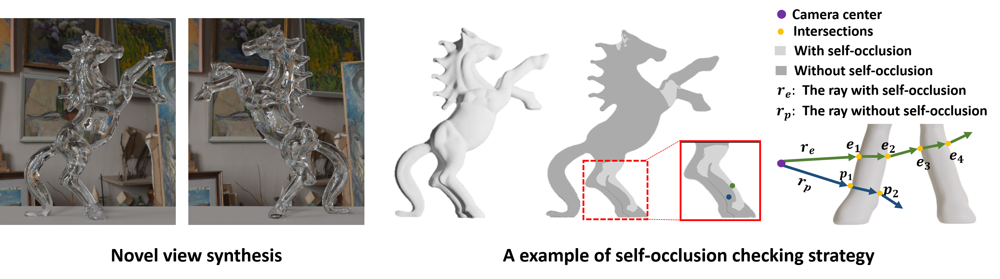

# NeTO:Neural Reconstruction of Transparent Objects with Self-Occlusion Aware Refraction-Tracing (ICCV 2023)

## [Project Page](https://www.xxlong.site/NeTO/) | [Paper](https://arxiv.org/pdf/2303.11219.pdf) | [Data](https://drive.google.com/drive/folders/1gSLI58O8FRN_Dq_Zjv6z3W2jfvqnE7Jo?usp=drive_link)

<!-- we will release the code soon. -->



## Introduction
 We present a novel method called NeTO, for capturing the 3D geometry of solid transparent objects from 2D images via volume rendering. 
    Reconstructing transparent objects is a very challenging task, which is ill-suited for general-purpose reconstruction techniques due to the specular light transport phenomena.
    Although existing refraction-tracing-based methods, designed especially for this task, achieve impressive results, they still suffer from unstable optimization and loss of fine details since the explicit surface representation they adopted is difficult to be optimized, and the self-occlusion problem is ignored for refraction-tracing.
    In this paper, we propose to leverage implicit Signed Distance Function (SDF) as surface representation and optimize the SDF field via volume rendering with a self-occlusion aware refractive ray tracing. 
    The implicit representation enables our method to be capable of reconstructing high-quality reconstruction even with a limited set of views, and the self-occlusion aware strategy makes it possible for our method to accurately reconstruct the self-occluded regions. 
    Experiments show that our method achieves faithful reconstruction results and outperforms prior works by a large margin.


#### Data Convention
The data is organized as follows:

```
<case_name>
|-- cameras_xxx.npz    # camera parameters
|-- screen_point.npy   # 3D position on the screen 
|-- mask
    |-- 000.png        # target mask each view (For unmasked setting, set all pixels as 255)
    |-- 001.png
    ...
|-- light_mask
    |-- 000.png        # ray-position correspondences mask each view (For unmasked setting, set all pixels as 255)
    |-- 001.png
    ...  
```

Here the `cameras_xxx.npz` follows the data format in [IDR](https://github.com/lioryariv/idr/blob/main/DATA_CONVENTION.md), where `world_mat_xx` denotes the world to image projection matrix, and `scale_mat_xx` denotes the normalization matrix.


### Setup

Clone this repository
```shell
git clone https://github.com/xxlong0/NeTO.git
cd NeTO
conda create -n neto python=3.8
conda activate neto
pip install -r requirements.txt
```

<details>
  <summary> Dependencies (click to expand) </summary>

  - torch==1.8.0
  - opencv_python==4.5.2.52
  - trimesh==3.9.8 
  - numpy==1.19.2
  - pyhocon==0.3.57
  - icecream==2.1.0
  - tqdm==4.50.2
  - scipy==1.7.0
  - PyMCubes==0.1.2
  - tensorboard==2.14.0
</details>

### Running
- **Training**

```shell
python NeTO.py --mode train --conf ./confs/base.conf --case <case_name>
```

- **Extract surface from trained model** 

```shell
python NeTO.py --mode validate_mesh --conf <config_file> --case <case_name> --is_continue # use latest checkpoint
```

The corresponding mesh can be found in `exp/<case_name>/<exp_name>/meshes/<iter_steps>.ply`.

<!-- ### Train NeTO with your custom data
```shell
cd utils/data_process
python process_transparent.py --path <image path> --mode <case_name>  
``` -->

## Citation

Cite as below if you find this repository is helpful to your project:

```
@article{li2023neto,
  title={NeTO: Neural Reconstruction of Transparent Objects with Self-Occlusion Aware Refraction-Tracing},
  author={Li, Zongcheng and Long, Xiaoxiao and Wang, Yusen and Cao, Tuo and Wang, Wenping and Luo, Fei and Xiao, Chunxia},
  journal={arXiv preprint arXiv:2303.11219},
  year={2023}
}
```

## Acknowledgement

Some code snippets are borrowed from [NeuS](https://github.com/Totoro97/NeuS.git) and [TransparentShapeRealData](https://github.com/yuyingyeh/TransparentShapeRealData.git). Thanks for these great projects.


# NeTO:神经重建透明物体的自遮挡感知折射追踪 (ICCV 2023)

## [项目页面](https://www.xxlong.site/NeTO/) | [论文](https://arxiv.org/pdf/2303.11219.pdf) | [数据](https://drive.google.com/drive/folders/1gSLI58O8FRN_Dq_Zjv6z3W2jfvqnE7Jo?usp=drive_link)

<!-- 我们将很快发布代码。 -->


## 介绍
我们提出了一种新方法，称为NeTO，用于通过体积渲染从2D图像捕获固体透明物体的3D几何形状。
重建透明物体是一项非常具有挑战性的任务，由于镜面光传输现象，它不适合通用重建技术。
尽管现有的基于折射追踪的方法专门为此任务设计，取得了令人印象深刻的结果，但它们仍然面临不稳定的优化和细节丢失的问题，因为它们采用的显式表面表示难以优化，并且忽略了折射追踪中的自遮挡问题。
在本文中，我们提出利用隐式签名距离函数（SDF）作为表面表示，并通过自遮挡感知的折射光线追踪优化SDF场。
隐式表示使我们的方法能够在有限的视图集下实现高质量重建，而自遮挡感知策略使我们的方法能够准确重建自遮挡区域。
实验表明，我们的方法实现了真实的重建结果，并大幅超越了之前的工作。

#### 数据约定
数据组织如下：

```
<case_name>
|-- cameras_xxx.npz    # 相机参数
|-- screen_point.npy   # 屏幕上的3D位置 
|-- mask
    |-- 000.png        # 每个视图的目标掩码（对于未掩码设置，将所有像素设置为255）
    |-- 001.png
    ...
|-- light_mask
    |-- 000.png        # 每个视图的光线位置对应掩码（对于未掩码设置，将所有像素设置为255）
    |-- 001.png
    ...  
```

这里的`cameras_xxx.npz`遵循[IDR](https://github.com/lioryariv/idr/blob/main/DATA_CONVENTION.md)中的数据格式，其中`world_mat_xx`表示世界到图像的投影矩阵，`scale_mat_xx`表示归一化矩阵。

### 设置

克隆此存储库
```shell
git clone https://github.com/xxlong0/NeTO.git
cd NeTO
conda create -n neto python=3.8
conda activate neto
pip install -r requirements.txt
```

<details>
  <summary> 依赖项（点击展开） </summary>

  - torch==1.8.0
  - opencv_python==4.5.2.52
  - trimesh==3.9.8 
  - numpy==1.19.2
  - pyhocon==0.3.57
  - icecream==2.1.0
  - tqdm==4.50.2
  - scipy==1.7.0
  - PyMCubes==0.1.2
  - tensorboard==2.14.0
</details>

### 运行
- **训练**

```shell
python NeTO.py --mode train --conf ./confs/base.conf --case <case_name>
```

- **从训练模型中提取表面** 

```shell
python NeTO.py --mode validate_mesh --conf <config_file> --case <case_name> --is_continue # 使用最新的检查点
```

相应的网格可以在`exp/<case_name>/<exp_name>/meshes/<iter_steps>.ply`中找到。

<!-- ### 使用您的自定义数据训练NeTO
```shell
cd utils/data_process
python process_transparent.py --path <image path> --mode <case_name>  
``` -->

## 引用

如果您发现此存储库对您的项目有帮助，请按以下格式引用：

```
@article{li2023neto,
  title={NeTO: Neural Reconstruction of Transparent Objects with Self-Occlusion Aware Refraction-Tracing},
  author={Li, Zongcheng and Long, Xiaoxiao and Wang, Yusen and Cao, Tuo and Wang, Wenping and Luo, Fei and Xiao, Chunxia},
  journal={arXiv preprint arXiv:2303.11219},
  year={2023}
}
```

## 致谢

一些代码片段借鉴自[NeuS](https://github.com/Totoro97/NeuS.git)和[TransparentShapeRealData](https://github.com/yuyingyeh/TransparentShapeRealData.git)。感谢这些伟大的项目。
